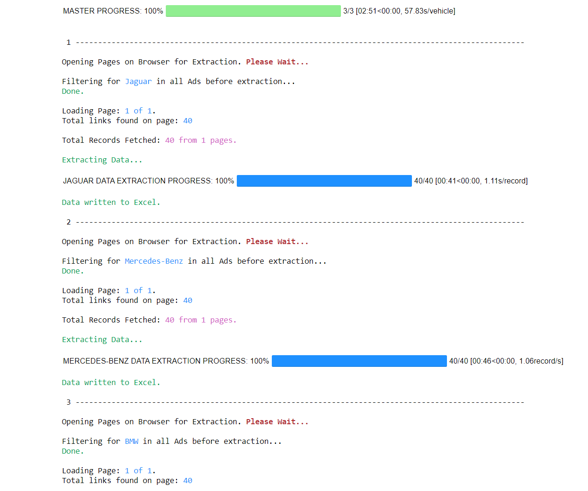
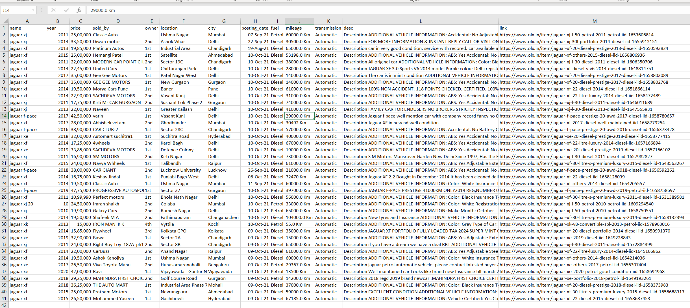

# OLXDataScrapper
Repo to scrap used cars data from OLX.
Add car names to the list in the USER CONFIG section and run the script.
Ensure the car names added to the list exist in the filter section of OLX Page.
Output will be stored to CSV format in the root directory.

Screenshot of Expected Output below for JupyterNotebook. Similar outputs will appear on other IDE outputs as well.

Screenshot of Final Output of one of the generated CSV files:

